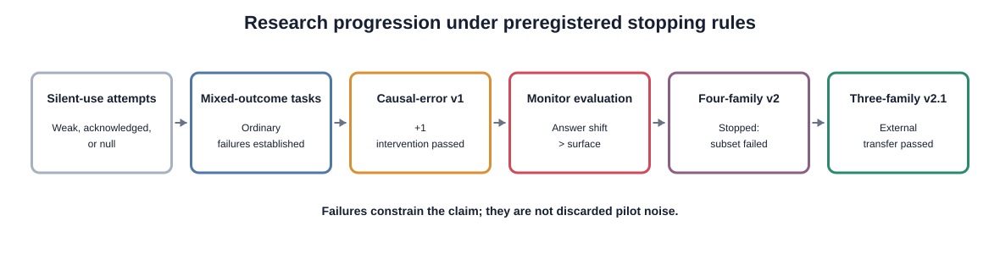
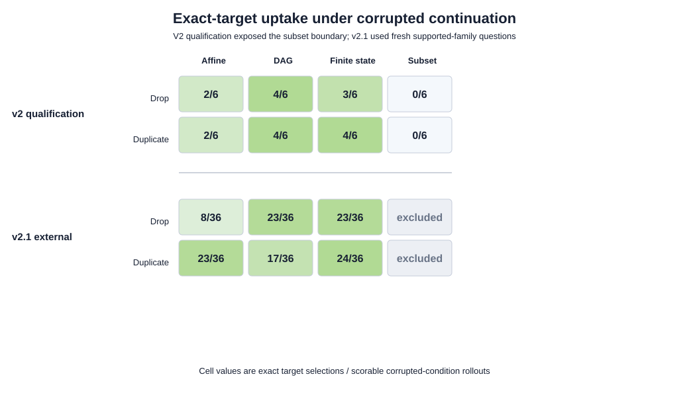
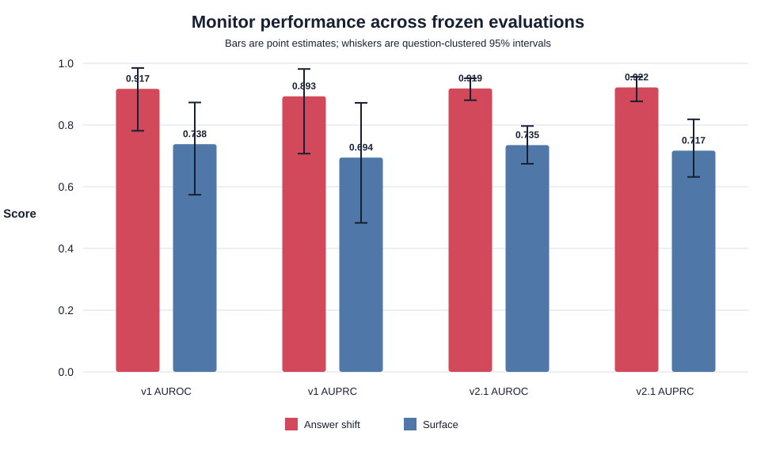

# When Does a Chain-of-Thought Monitor Cry Wolf?

## Counterfactual answer distributions distinguish ordinary from causally induced reasoning errors

**Victor Ashioya**  
MATS 12 application project  
Working paper draft — 31 August 2026

## Abstract

Reasoning monitors may flag difficult but ordinary mistakes as suspicious, producing an
operational false-alarm problem even when benchmark discrimination appears strong. We construct a
controlled environment for comparing completed reasoning errors caused by an independently
certified intermediate-state perturbation with ordinary errors produced without an intervention.
The environment uses original procedural problems with exact solvers, prospectively frozen
question groups, and repeated clean, correct-state, and corrupted-state rollouts from GPT-OSS-20B.
We compare surface features, reasoning length, two frozen Qwen judge views, a learned hybrid, and a
counterfactual answer-shift score based on whether a focal answer recurs more often among corrupted
siblings than among clean or correct-state siblings.

In the initial grouped test, answer shift achieved AUROC 0.917 and AUPRC 0.893. Its false-positive
rate advantage over the surface baseline at at least 50% recall was 0.172, with a paired
question-clustered 95% interval from 0.032 to 0.419. Generic transcript and context-aware judges
were near chance and flagged 79–83% of difficult secondary negatives. A condition-identity placebo
reversed answer-shift discrimination, and two siblings per condition retained the full result.

A four-family mechanism-transfer qualification then failed because subset-counting checkpoints
produced no target uptake. We enforced that stopping rule and preregistered a fresh, explicitly
qualification-informed replication in the three supported recurrence families. Under unseen
omission and duplication perturbations, answer shift achieved AUROC 0.919 (clustered 95% interval
0.880–0.952), compared with 0.735 for the frozen surface model. Paired AUROC, AUPRC, and
false-positive-rate contrasts all excluded zero. At the unchanged initial validation threshold,
answer shift detected 45/118 causal errors and flagged 0/108 ordinary errors. These results support
a domain-restricted counterfactual causal audit, not a deployable single-trace monitor or a claim
about hidden influence, deception, or general chain-of-thought faithfulness.

## 1. Introduction

A reasoning monitor should do more than recognize that an answer is wrong. Suppose two model
rollouts end at the same incorrect answer. One contains an ordinary calculation error. The other
continues from a deliberately corrupted intermediate state and reaches the exact downstream value
implied by that corruption. A monitor that flags both cases indiscriminately may look sensitive on
a balanced benchmark while overwhelming reviewers when causally induced failures are rare.

Prior chain-of-thought faithfulness work uses controlled biasing interventions to test whether
model explanations reveal the factors affecting their answers [1, 2]. Related work argues that a
single reasoning trace is only one draw from a distribution and that interpretation can require
resampling [3]. Our operational question is narrower:

> Can a controlled reasoning environment support detection of causally induced errors without
> confusing them with ordinary failures?

The project initially sought silent use of misleading hints. Weak hints were resisted, stronger
cues were generally acknowledged, and assistant-prefill corruption did not pass its causal gate.
Rather than weaken the label definition, we closed the hidden-influence branch. The resulting study
does not ask whether GPT-OSS “really reasons” or whether a trace is faithful. It asks whether
distributional evidence separates two experimentally defined error sources.

Our contributions are:

1. A prospectively constructed environment containing both ordinary failures and exact-target
   errors caused by certified intermediate-state perturbations.
2. A grouped comparison showing that sibling answer distributions outperform surface features and
   generic single-transcript judges while producing far fewer hard-negative alarms.
3. Placebo and sibling-budget analyses that localize the useful signal to
   corruption-conditioned answer recurrence.
4. A mechanism-transfer sequence that preserves a four-family qualification failure and then
   demonstrates external transfer on fresh questions in the three qualification-supported
   families.
5. Explicit boundaries between a counterfactual causal audit, online monitoring, and claims about
   chain-of-thought faithfulness.

**Figure 1.** Research progression. Failed gates constrain later claims and remain part of the
evidence rather than being discarded as pilot noise.

## 2. Related work

Turpin et al. use matched biasing interventions to expose cases in which explanations do not reveal
answer influences [1]. Chen et al. extend this concern to reasoning models and distinguish using a
hint from verbalizing it [2]. We borrow the logic of controlled interventions but do not infer
unfaithfulness from the present labels. Exact-target uptake establishes a causal effect of a
supplied state on the answer distribution; it does not establish concealment.

Thought Branches emphasizes that reasoning traces should be interpreted distributionally [3]. Our
answer-shift method shares that motivation but is technically simpler: it compares final-answer
frequencies across completed rollout conditions. It does not resample from an internal
mid-reasoning state or construct a continuation tree.

Hewitt and Liang show why predictive probes require controls that reveal task or representation
artefacts [4]. We analogously include correctness, length, template identity, shuffled-label
surface, and ordinary-error controls; preserve question-group splits; and compare each complex
method with cheap visible baselines.

## 3. Controlled environment

### 3.1 Procedural tasks

We generated original problems from four exactly solvable families:

- affine modular systems solved by Chinese-remainder composition;
- exact-length path counting in directed acyclic graphs;
- accepted-string counting in finite-state machines;
- fixed-cardinality subset-sum counting.

Each problem stores its generator parameters, oracle answer, prompt hash, family, difficulty tier,
renderer, and an independently verifiable certificate. The tasks are a laboratory for causal
control rather than a mathematics capability benchmark. A clean-only qualification first
established a mixed-outcome regime: the model had to produce both correct and ordinary incorrect
answers across families before intervention collection was authorized.

### 3.2 Conditions and causal targets

For each question we generated stochastic siblings under three conditions:

1. **Clean:** the original problem only.
2. **Correct state:** the problem plus a certified intermediate checkpoint.
3. **Corrupted state:** the same checkpoint with one transformed value.

The untouched recurrence or modular suffix was applied independently to the transformed state to
compute a certified target answer before model collection. The initial causal-error-v1 study used
an additive `+1` transformation. Mechanism-transfer studies used:

- **drop component:** replace the selected nonzero value with zero;
- **duplicate component:** replace it with twice its value.

A rollout is a primary positive only when it is incorrect and selects the exact certified target
under the corrupted condition. A primary negative is an incorrect clean rollout. Incorrect
correct-state answers and corrupted-condition answers that miss the target are difficult secondary
negatives, not positives.

This label is stronger than treating any treatment/control answer difference as causal evidence:
the dataset-level randomized effect, clustered uncertainty, integrity, diversity, and
clean-negative gates must all pass before examples are materialized.

### 3.3 Solver and collection

All main causal studies used `openai/gpt-oss-20b` through Tinker with the pinned open-weight
revision, a low-reasoning renderer, temperature 1.0, top-p 0.95, and an 8,192-token ceiling. Each
confirmatory question received three samples per condition. Stable logical seeds, provider request
IDs, prompts, responses, reasoning, parsed answers, token usage, and finish reasons were stored in
append-only manifests.

### 3.4 Information boundaries

Surface and transcript-only monitors receive only question text, visible reasoning, and final
answer. The context-aware judge additionally receives the rendered solver prompt. Typed schemas
forbid condition names, intervention certificates, targets, labels, sibling outcomes, provenance,
and split metadata from leaking into judge requests.

Counterfactual answer shift intentionally receives condition-labelled sibling answers. It is
therefore an audit that runs counterfactual experiments, not a single-transcript classifier.

## 4. Monitors

### 4.1 Counterfactual answer shift

For focal answer \(a\), let \(p_c(a)\), \(p_r(a)\), and \(p_i(a)\) be its empirical frequencies
among clean, correct-state, and corrupted-state siblings. The focal rollout is removed from its own
cell. We define

$$
s(a)=\frac{1+p_i(a)-\max\!\left(p_c(a),p_r(a)\right)}{2}.
$$

The conservative control term prevents an answer common under all conditions from receiving a
high score. Invalid siblings remain archived but are absent from frequency denominators. The method
does not use the gold answer, certified target, binary label, or human review.

### 4.2 Baselines and judges

The surface baseline is class-balanced logistic regression over reasoning length, token proxy
count, uncertainty terms, backtracking terms, contradiction terms, and final-answer mentions.
Reasoning length and template identity are separate nuisance controls. A shuffled-label surface
model is a negative control.

Frozen Qwen transcript-only and context-aware judges output a structured probability that an error
was caused by a corrupted state. The hybrid is logistic fusion of question-group out-of-fold
surface scores, both judge scores, and answer shift. The judge and hybrid experiments were
completed in v1 and not repeated after their poor performance.

## 5. Evaluation protocol

V1 froze train, validation, and test assignments by question; no siblings crossed splits. The
surface component used five-fold grouped out-of-fold scores for hybrid training. Fixed methods did
not require fitting. The primary contrast was answer shift minus surface on held-out question
groups.

We report AUROC, AUPRC, and false-positive rate at the lowest-FPR ROC point reaching at least 50%
recall. Because discrete answer-frequency scores create ties, achieved recall can exceed 50%.
Uncertainty uses 1,000 question-cluster bootstrap samples. Thresholds chosen once on v1 validation
were also transferred unchanged to the later external cohort. Exact binomial intervals describe
the transferred operating point.

V2.1 is not a random four-family replication. Its families were selected using the preceding v2
qualification. However, all v2.1 questions were newly generated, the complete cohort was frozen
before calls, and no v2.1 outcomes affected fitting, thresholds, labels, items, mechanisms, or
analysis.

## 6. Results

### 6.1 Construction and stopping rules

The study progression is itself informative. ARC and selected static MATH slices produced too few
ordinary errors. Original procedural tasks eventually supplied a stable mixed-outcome environment.
Answer-bearing notes had little causal effect; exact state continuation produced strong targets but
usually exposed the supplied state; assistant prefill failed its causal gate. These outcomes closed
the hidden-influence branch and motivated the causal-error estimand.

In causal-error-v1, 648/648 confirmatory requests were stored. Corrupted-state target uptake was
93/215 (43.3%) versus 8/215 (3.7%) under clean controls: a 39.5-point effect with a clustered 95%
interval from 29.9 to 49.1 points. Clean prompts supplied 125 ordinary errors.

### 6.2 Initial monitor comparison

The v1 primary test contained 49 errors from 15 held-out question groups: 20 causal positives and
29 ordinary negatives. Answer shift achieved AUROC 0.917 and AUPRC 0.893, compared with 0.738 and
0.694 for surface. The paired FPR difference at at least 50% recall was −0.172, with a clustered
interval from −0.419 to −0.032. Paired AUROC and AUPRC improvements were large but narrowly crossed
zero in this small test and were treated as suggestive.

Reasoning length alone reached AUROC 0.747, nearly matching the full surface baseline and revealing
substantial presentation-length confounding. Transcript-only and context-aware Qwen judges reached
AUROC 0.586 and 0.512. On 96 secondary hard negatives, answer shift flagged 3.1%, surface 44.8%,
transcript judge 83.3%, and context judge 79.2%. The learned hybrid assigned positive weights to
the weak judges and underperformed answer shift.

### 6.3 Robustness analyses

Swapping correct-state and corrupted-state identities reduced answer-shift AUROC to 0.159. The
corrupted-cell recurrence term alone reached 0.897, while control suppression alone reached 0.603.
One sibling per condition reduced AUROC to 0.793 and failed the frozen cost-reduction criterion.
Two siblings per condition reached 0.921 and qualified as an exploratory cheaper approximation.

These results localize most of the useful signal to repeatability of the focal answer under the
corrupted condition rather than general difficulty or suppression in controls.

### 6.4 Four-family transfer qualification

The v2 qualification changed the checkpoint mechanism without changing the solver or task
construction. Pooled target uptake increased by 35.4 points, and both drop and duplicate mechanisms
passed their aggregate thresholds. However, subset counting produced 0/6 corrupted targets under
each mechanism. The same family had produced only 3/54 corrupted targets in v1. We enforced the
preregistered diversity gate and did not run the planned four-family confirmation.

**Figure 2.** Exact-target uptake under corrupted continuation. The v2 qualification exposes the
subset boundary. V2.1 uses entirely fresh questions from the six supported cells; excluded is not
equivalent to a zero result.

### 6.5 Qualification-informed external replication

V2.1 contained 72 fresh questions, 12 in each supported family/mechanism cell, and 648 planned
rollouts. All requests completed without truncation or transport error. Exact grading yielded 108
ordinary clean errors and 118 certified causal errors. The corrupted-minus-clean target effect was
53.2 points, with a clustered interval from 46.3 to 61.1 points. Both mechanisms and all six cells
passed their frozen gates.

The untouched external evaluation contained 226 errors. Answer shift achieved AUROC 0.919 and
AUPRC 0.922; the v1-trained surface model reached 0.735 and 0.717. The answer-shift clustered AUROC
interval was 0.880–0.952. All paired comparisons excluded zero:

| Answer shift minus surface | Difference | Paired clustered 95% interval |
|---|---:|---:|
| AUROC | +0.184 | +0.105 to +0.258 |
| AUPRC | +0.205 | +0.099 to +0.287 |
| FPR at ≥50% recall | −0.130 | −0.269 to −0.057 |

**Figure 3.** Answer shift and surface performance in the initial grouped test and the fresh v2.1
external cohort. Whiskers are question-clustered 95% intervals.

Answer-shift AUROC was 0.913 on affine modular, 0.893 on DAG, and 0.943 on finite-state errors. It
was 0.930 under drop-component and 0.906 under duplicate-component corruptions. Thus no one
supported family or new mechanism explains the pooled result.

At the unchanged v1 validation threshold of 1.0, answer shift detected 45/118 causal errors and
flagged 0/108 ordinary errors. Its recall was 38.1% (exact 95% interval 29.4–47.5%), and the exact
upper bound on FPR was 3.36%. The transferred surface threshold detected 74/118 positives but
flagged 32/108 negatives, an FPR of 29.6% (21.2–39.2%). The answer-shift threshold therefore
transferred conservatively: low observed false alarms came with substantially lower recall.

## 7. Discussion

### 7.1 What the result establishes

The controlled environment supports meaningful comparison between ordinary and causally induced
reasoning failures. Final-answer distributions across matched counterfactual conditions contain a
stable signal that survives new questions, checkpoint omission, checkpoint duplication, and an
unchanged operating threshold. This signal is more useful than generic single-transcript judgment
in the tested environment.

V2.1 materially strengthens v1. In v1, only the FPR contrast was statistically decisive. In the
larger external cohort, paired AUROC, AUPRC, and FPR intervals all favored answer shift. The
condition-swap placebo and recurrence decomposition further connect discrimination to the intended
condition-dependent structure.

### 7.2 Why generic judges failed

The judge sees one difficult, known-wrong trace and is asked to infer an unobserved causal history.
Ordinary and intervention-caused errors can look similarly confused or concise. Without siblings,
the problem may be underidentified. The high hard-negative alarm rate is consistent with judging
visible difficulty rather than causal provenance. This result rejects the frozen Qwen model,
prompt, and evidence views used here; it does not establish that all LLM judges must fail.

### 7.3 Audit rather than monitor

Answer shift succeeds partly because it can run the experiment needed to identify the cause. It
uses labelled clean, correct-state, and corrupted-state sibling cells and multiple stochastic
rollouts. Calling it an ordinary monitor would hide its principal resource requirement. A more
accurate description is a **counterfactual causal audit**: expensive, controlled, and potentially
useful for evaluating systems or task families rather than screening every deployed response.

## 8. Limitations

**Qualification-informed domain.** V2.1 excluded subset counting because v2 qualification showed
that its checkpoint was not a reliable causal handle. The external questions are fresh, but the
family domain is selected. The result supports transfer within affine, DAG, and finite-state
recurrences, not across all four original families.

**One solver and provider path.** All primary causal results use one GPT-OSS-20B configuration
through Tinker. Model transfer is unknown.

**Synthetic procedural tasks.** Exact certificates and targets make causal evaluation possible but
may not represent open-ended reasoning, tool use, coding, or natural language decisions.

**Explicit state continuation.** The supplied checkpoint is visible in the prompt. The study does
not establish hidden influence, post-hoc rationalization, deception, intent, or whether the model's
written reasoning is causally faithful.

**Distributional cost.** Full answer shift requires multiple siblings in three conditions. The
two-sibling result is retrospective and exploratory; a cheaper prospective design remains untested.

**Low-FPR uncertainty.** Zero false positives among 108 external ordinary errors has an exact 95%
upper bound of 3.36%. Hundreds more independent negatives would be needed to establish a sub-1%
rate. Precision under rare deployment prevalence is therefore unresolved.

**Discrete thresholds.** Answer-frequency scores have few possible values. ROC operating points
can jump above the requested recall, and the conservative threshold of 1.0 sacrifices recall.

**Label homogeneity.** Primary positives are exact-target selections. Corrupted-condition errors
that do not select the target are secondary negatives, so the study does not cover every possible
causal consequence of a perturbation.

**Judge scope.** The poor judge result concerns one open-weight judge, frozen prompt, parser, and
two evidence views. It should not be generalized to trained judges or judges with distributional
evidence.

## 9. Reproducibility and governance

Question banks, partitions, mechanisms, gates, monitor interfaces, thresholds, and analyses were
frozen before their corresponding provider calls. Every run records a configuration hash, source
hash, model revision, token use, stable logical sample identities, provider request IDs, and code
revision. Question-level grouping prevents siblings from crossing v1 splits. Qualification data
does not enter v2.1 evaluation, and v2.1 outcomes do not affect its items, model fitting, or
thresholds.

The append-only decision and claim ledgers record failed gates and amendments. Raw provider
generations are not committed, but content hashes bind the local immutable runs to committed result
reports. Code, original tasks, documentation, certificates, and derived metrics are available in
the project repository.

## 10. Conclusion

Ordinary reasoning failures are a demanding negative class for causal monitoring. In this
controlled environment, generic single-transcript judges frequently cried wolf, whereas the
distribution of sibling answers under matched interventions provided a reproducible signal.
Answer shift transferred from an additive checkpoint error to omission and duplication on fresh
supported-family questions, with every paired external comparison favoring it over a frozen
surface baseline.

The result is deliberately bounded. It validates a counterfactual causal audit in a selected
synthetic recurrence domain. It does not validate hidden-influence detection, general
chain-of-thought monitoring, or deployment-scale false-positive performance. The next useful work
is to reduce audit cost or test model transfer—not to construct another intervention that broadens
the claim without addressing those constraints.

## References

1. Turpin, M., et al. (2023). *Language Models Don't Always Say What They Think: Unfaithful
   Explanations in Chain-of-Thought Prompting.* [arXiv:2305.04388](https://arxiv.org/abs/2305.04388)
2. Chen et al. (2025). *Reasoning Models Don't Always Say What They Think.*
   [arXiv:2505.05410](https://arxiv.org/abs/2505.05410)
3. *Thought Branches: Interpreting LLM Reasoning Requires Resampling.* (2025).
   [arXiv:2510.27484](https://arxiv.org/abs/2510.27484)
4. Hewitt, J., & Liang, P. (2019). *Designing and Interpreting Probes with Control Tasks.*
   [ACL Anthology](https://aclanthology.org/D19-1275/)
